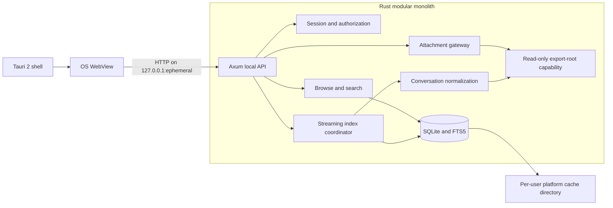

# ADR-0001: Local Desktop Architecture

- Status: Accepted
- Decision date: 2026-07-28
- Scope: macOS MVP architecture, private-data boundary, local transport, indexing, and packaging

## Context

The application must browse official ChatGPT export directories that may contain:

- at least 10,000 conversations;
- at least 10,000 attachments;
- at least 500 MB of conversation JSON split across an unknown number of shards; and
- several gigabytes of media.

The source export is private, untrusted input. It may contain malformed JSON, hostile Markdown or HTML, path-traversal metadata, symlinks, misleading MIME types, oversized records, and attachment formats that should never execute inside the application.

The supported MVP must run on macOS, remain responsive while indexing, work
without external network services, keep the source export read-only, and
provide a polished browser-style interface for nontechnical users. Windows and
Linux are future portability work and are not supported MVP targets.

## Decision

Build a **Tauri 2 desktop application** as a **Rust modular monolith** with a **React and TypeScript** user interface.

The Rust process will start an Axum listener using an already-bound IPv4 socket at `127.0.0.1:0`. The operating system will select an available port. Axum will serve both the bundled production SPA and an application-local `/api` from that single origin.

The application will not expose Tauri filesystem, SQL, shell, or general-purpose invoke APIs to the WebView. The renderer will receive only bounded response objects and opaque identifiers. After selection, filesystem paths, SQLite handles, archive capabilities, and parser state remain in Rust. If a user explicitly types a path instead of using the native picker, that path is transient request input and is never echoed, logged, or persisted.

### High-level design



### Module boundaries

The Rust application uses narrow internal modules:

| Module                | Responsibility                                                                                     |
| --------------------- | -------------------------------------------------------------------------------------------------- |
| `lib`                 | Tauri lifecycle, window policy, resource resolution, and platform integration                      |
| `server`              | Loopback binding, session authorization, routes, security headers, request limits, and file saving |
| `safe_root`           | Folder validation, shard discovery, attachment inventory, and read-only root capability            |
| `json_stream`         | Bounded top-level-array streaming and malformed-input detection                                    |
| `conversation`        | Schema projection, graph validation, role normalization, and opaque identifiers                    |
| `indexer`             | Background indexing, progress, cancellation, and selected-export session state                     |
| `store`               | SQLite schema, shard transactions, FTS5 queries, cache hardening, and index discard                |
| `attachments`         | Attachment matching, signature detection, preview policy, and bounded text reads                   |
| `structure_inspector` | Fixed-schema, value-suppressing compatibility diagnostics                                          |
| `models`, `error`     | Bounded transport objects and fixed public error codes                                             |

These are code modules in one deployable application, not separate services.

## Local transport and authorization

The loopback listener is a security boundary, even though it cannot accept LAN connections.

1. Bind a numeric IPv4 listener to `127.0.0.1:0`.
2. Read the selected port from the bound socket and pass the exact URL to the Tauri window.
3. Generate at least 256 bits of cryptographically secure random session material for every launch.
4. Put the bootstrap secret in the initial URL fragment, which is not sent in the HTTP request.
5. Remove the fragment immediately with `history.replaceState` and retain the secret only in module memory.
6. Require `Authorization: Bearer` for every private API request.
7. Do not use an authentication cookie because cookies are not scoped by port.
8. Fetch preview bytes only after an explicit user action, using the bearer-authenticated API, then expose a process-local blob URL to the media element.
9. Reject unexpected `Host`, `Origin`, method, content type, and body size values.
10. Send no permissive CORS headers.
11. Disable directory listing, API introspection, verbose server errors, and ordinary HTTP access logs.
12. End the listener and invalidate the session capability when the application process exits. Discarding only the index leaves the selected read-only export session active.

The random port reduces collisions and casual discovery. It is not authentication.

The production response policy will include, at minimum:

```text
Content-Security-Policy:
  default-src 'self';
  base-uri 'none';
  form-action 'none';
  frame-ancestors 'none';
  object-src 'none';
  script-src 'self';
  style-src 'self';
  style-src-elem 'self';
  style-src-attr 'unsafe-inline';
  font-src 'self';
  connect-src 'self';
  img-src 'self' data: blob:;
  media-src 'self' blob:;
  worker-src 'self' blob:
Referrer-Policy: no-referrer
X-Content-Type-Options: nosniff
Cross-Origin-Opener-Policy: same-origin
```

The style-attribute exception is limited to React and TanStack Virtual's
calculated progress widths, virtual-list height, and row transforms.
`script-src` remains self-only and does not permit `unsafe-inline`.

The current window policy blocks navigation away from the application origin,
and rendered export links are inert. Broader platform verification for new
windows, permission prompts, and developer tools remains a release gate. Any
future external-open feature must require a clear user action and explain that
it may make a network request outside the application.

## Export-root capability

The selected directory will be opened once in Rust as a read-only directory capability. All later reads will be relative to that capability.

- Use directory-capability-relative opens, no-follow behavior, and handle revalidation to keep reads inside the selected root.
- Reject absolute paths, parent traversal, alternate path prefixes, embedded NUL characters, device paths, and paths that resolve outside the selected root.
- Treat symlinks as hostile. A symlink that escapes the root must fail closed.
- Do not send the selected absolute path to the renderer.
- Do not write, rename, normalize, touch, lock, or create files inside the source export.
- Do not persist the selected absolute path in the index, logs, crash artifacts, source code, documentation, or test snapshots.
- Use an opaque archive ID in the renderer. Derive the current stable cache key as a BLAKE3 digest of the canonical path rather than using the literal path as a directory name. Treat that digest as an opaque label, not as cryptographic protection against path guessing.

The user will reselect an export after restart in the initial implementation. Remembering recent paths is outside the first release and would require a separate privacy decision.

## Streaming ingestion

Conversation shards are authoritative for conversation content. Generated HTML is not an ingestion source.

The current indexer:

1. discovers supported conversation shards without assuming a fixed count;
2. opens each shard read-only through the root capability;
3. parses its top-level JSON array in 64 KiB read chunks;
4. buffers at most one bounded 32 MiB conversation record at a time;
5. projects and releases one conversation before reading the next;
6. checks cancellation before a shard, between records, and before commit;
7. reports byte and aggregate record progress without exposing content;
8. hashes each shard while reading it; and
9. replaces one shard inside a SQLite transaction that becomes visible only at commit.

An interrupted shard transaction rolls back and does not replace its last
committed version. Resume is currently at shard granularity. Persisted,
validated top-level record offsets may be added later if profiling shows that
rereading a partial shard is materially costly.

Shard skip detection currently uses the recorded relative shard name, size, and
high-resolution modification time. A BLAKE3 digest is recorded during parsing
for future stronger change detection; it is not currently used to skip a shard.

## SQLite and search

Bundle SQLite with the application and verify FTS5 support at startup. Use `rusqlite` on dedicated blocking database workers rather than opening SQLite in the renderer.

The normalized index will contain, at minimum:

- shard and indexing-run state;
- conversations and filter fields;
- mapping nodes with parent references, message text, and normalized roles;
- attachment metadata and resolved relative candidates;
- sanitized diagnostic codes; and
- an external-content FTS5 table for conversation titles and message text.

Queries will be parameterized. The application will parse user search input into a deliberately small search grammar instead of passing arbitrary FTS syntax through unchanged.

Use WAL mode so browsing can continue while a shard is being replaced. Readers
see the last committed version until the replacement transaction commits.
Cancellation or failure before commit rolls the transaction back.

The database, WAL, shared-memory, and rollback-journal files live in the
operating system's per-user cache directory, never in the repository or source
export.

The index contains private plaintext. The user interface and documentation must
state this plainly. On macOS, cache directories use mode `0700` and cache files
use mode `0600`. The SQLite database and its sidecars have a combined 16 GiB
ceiling, indexing preserves a 512 MiB free-space reserve, and preflight
budgeting uses a conservative estimate of four times the source shard size.
SQLCipher is not part of the first release because of packaging and
key-management complexity.

## Conversation reconstruction

The active conversation path will be reconstructed by walking parent references from `current_node`, detecting missing nodes and cycles, then reversing the valid chain. Path order is authoritative; timestamps are display metadata and do not reorder the chain.

Parent references preserve enough graph structure to expose alternate branches.
The current database does not preserve source child-array order; alternate
choices are ordered deterministically by message time and opaque node ID.

Unknown roles and content types will be preserved as safe metadata and shown as `other` or `unsupported`; they will not crash ingestion.

## Attachment policy

Attachment metadata is untrusted.

- Match known attachment identifiers to local `.dat` candidates in Rust.
- Preserve the original display name as text only; never rename the source file.
- Inspect a bounded prefix for file signatures and combine that result with a bounded UTF-8/text check.
- Never trust an extension or declared MIME type by itself.
- Serve images only for PNG and JPEG after validating encoded dimensions and decoded-pixel bounds.
- Offer audio and video controls only for the frontend MIME allowlist; actual playback still depends on platform WebView codec support.
- Render PDF pages through a locally bundled PDF.js worker with scripting, external fetches, and automatic external navigation disabled.
- Render plain text, source, CSV, and JSON as escaped text with a preview-size limit.
- Never render SVG, HTML, JavaScript, office macros, or unknown formats as active inline content.
- Require an explicit preview action and reveal attachment cards in bounded batches.
- Stream allowlisted media through bounded concurrent and aggregate-byte budgets.
- Offer unsupported content only through an explicit native save-copy dialog.
- Re-resolve the opaque attachment ID for every preview, copy, or open request.

An external-open action must be explicit and must call an argument-vector operating-system API. It must never construct or execute a shell command from a filename, MIME type, message, or metadata value.

## Frontend

Use React, TypeScript in strict mode, and Vite.

- Use server-side pagination and list virtualization.
- Keep search results and conversation summaries bounded.
- Render Markdown through a CommonMark/GFM parser plus a strict sanitizer.
- Do not enable raw HTML or use `dangerouslySetInnerHTML` for export content.
- Render code as text through React nodes.
- Keep all fonts, icons, PDF assets, workers, and styles in the application bundle.
- Use locally generated synthetic content for screenshots and automated visual tests.

## Runtime network policy

Normal operation will make no connection outside the exact loopback origin created by the application.

- Do not include telemetry, analytics, advertising, crash upload, remote fonts, CDNs, cloud services, or automatic update checks.
- Do not include a general-purpose HTTP client in the renderer.
- Do not resolve hostnames during normal operation.
- Treat the loopback HTTP connection as local inter-process transport, not as a remote service.
- Add production tests that fail if the WebView attempts a non-loopback request.

Updates will be manual downloads for the first release.

## Packaging

Build and test a native macOS application bundle and disk image for the
supported target architecture. A distributable macOS release requires signing
and notarization.

Windows installers and Linux packages may be designed in a later portability
phase. They are not MVP artifacts or release gates.

Bundle PDF.js for consistent PDF behavior. Do not promise playback for codecs the platform WebView does not support; show a safe fallback instead.

Bundle SQLite to avoid system-version and FTS5 differences. Generate a software bill of materials and third-party license inventory for release artifacts.

## Alternatives considered

### Electron with TypeScript

**Advantages**

- One bundled Chromium version produces more consistent rendering, PDF, and media behavior.
- The contributor pool for a JavaScript-only desktop stack is large.
- Mature packaging and debugging tools are available.

**Reasons rejected**

- Shipping Chromium and Node creates larger installers and a larger security-update obligation.
- Native SQLite packages require ABI-aware builds for each Electron and platform combination.
- A renderer compromise has a higher-impact bridge to a privileged JavaScript runtime if any preload or IPC boundary is too broad.
- The Rust ingestion and path-containment layer would still be desirable, creating a mixed native architecture without Tauri's smaller shell.

Electron remains the fallback if OS WebView differences make the required experience unattainable.

### Rust or Go server opened in the user's default browser

**Advantages**

- A small backend and a standard browser sandbox.
- Straightforward loopback HTTP and Range responses.
- Potentially simple portable binaries.

**Reasons rejected**

- Native folder selection and application lifecycle are awkward.
- Closing the browser does not necessarily stop the backend.
- Browser profiles, extensions, privacy settings, and codec support vary.
- The result is less approachable for a nontechnical user.

The Axum API will remain sufficiently separated that a headless diagnostic mode could be added later without changing the core indexer.

### Tauri custom protocol and invoke-only API

**Advantages**

- No TCP listener.
- Tauri recommends its custom protocol when a localhost server is unnecessary.
- Strong capability configuration is available.

**Reasons rejected**

- Large attachment streaming and standard byte-range behavior are clearer and easier to test over HTTP.
- Serving the SPA and API from one exact loopback origin gives consistent browser semantics.
- The product requirements explicitly require a secure random-port design whenever a local server is used.

This choice creates additional local-server threats, so the authorization and origin controls in this ADR are release-blocking.

### Wails with Go

**Advantages**

- Good cross-platform WebView integration.
- Go has straightforward streaming JSON and concurrency primitives.

**Reasons rejected**

- Tauri has more granular desktop capability controls and a better fit for a Rust filesystem-security core.
- Wails shares the same OS WebView and Linux packaging limitations, so it does not remove the main platform risks.

## Consequences

### Positive

- Large exports can be processed with bounded memory.
- The renderer cannot directly enumerate the filesystem or open the database.
- The source export remains read-only by construction.
- React supports a polished, accessible, virtualized interface.
- Rust provides strong types at parser, path, and protocol boundaries.
- One modular deployable keeps contribution and operations simpler than multiple processes or services.

### Negative

- Rust and Tauri increase the initial implementation learning curve.
- WebView rendering, codec, and PDF behavior require focused macOS testing.
- The authenticated local server adds a security boundary that must be maintained.
- Release CI must build the macOS artifact, and release operations must sign and notarize it.
- A plaintext search index creates another local copy of private message text.

## Threats and required mitigations

| Threat                              | Required mitigation                                                                        |
| ----------------------------------- | ------------------------------------------------------------------------------------------ |
| LAN exposure                        | Bind only the numeric address `127.0.0.1` and verify the bound address in tests            |
| Cross-site request or DNS rebinding | Per-launch bearer token, exact `Host` and `Origin`, no CORS, no cookies, non-GET mutations |
| Stored XSS or Markdown injection    | No raw HTML, strict sanitizer, CSP, inert links, no privileged renderer APIs               |
| Path traversal or symlink escape    | Root capability, relative-only opens, handle revalidation, fail closed                     |
| MIME confusion and active files     | Signature inspection, allowlisted inline types, `nosniff`, attachment disposition          |
| Oversized or deeply nested JSON     | Streaming parser, nesting and per-record limits, disk quotas, cancellation                 |
| Malformed mapping graph             | Cycle detection, node/depth limits, sanitized diagnostics                                  |
| SQL or FTS injection                | Bound parameters and constrained search grammar                                            |
| Shell injection                     | No shell plugin; argument-vector OS calls only after explicit user action                  |
| Content disclosure in logs          | Structured codes and counts only; automated log-content tests                              |
| Content disclosure in browser state | Opaque IDs, no paths, token removed from URL, no persistent Web storage                    |
| Cache disclosure                    | Per-user permissions, prominent disclosure, index deletion, OS encryption guidance         |
| Runtime data exfiltration           | Offline assets, no telemetry/updater/CDN, deny non-loopback requests                       |
| Interrupted reindex                 | Per-shard transaction and atomic commit                                                    |
| Supply-chain compromise             | Locked dependencies, audits, SBOM, signed releases, reproducible CI inputs                 |

## Validation

This decision is valid only if the implementation proves all of the following:

- production binds exactly one listener to `127.0.0.1` on an OS-assigned port;
- unauthenticated and wrong-origin requests cannot read private data;
- a 500 MB synthetic shard is indexed without whole-file buffering;
- the UI remains responsive during indexing and cancellation;
- traversal and symlink escape tests fail closed on macOS;
- production rendering neutralizes malicious HTML and script fixtures;
- no production request reaches a non-loopback address;
- the macOS package passes an installed-artifact smoke test; and
- repository and Git-history privacy audits pass before the first push.

## Review triggers

Revisit this ADR if:

- OS WebView differences prevent required safe previews;
- a loopback-server control cannot be enforced consistently on a target platform;
- real-world synthetic benchmarks exceed the memory or latency budgets;
- encrypted local indexes become a release requirement;
- a mobile or browser-only edition enters scope; or
- the export schema changes enough to require a separate ingestion process.
