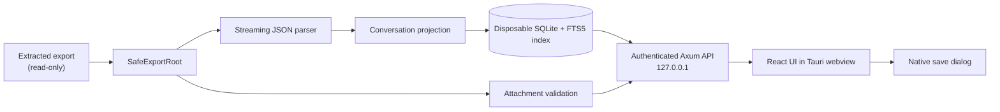

# Architecture

ChatGPT History Browser is a Rust modular monolith with a React and TypeScript
interface. Tauri provides the macOS application shell, but the webview has no
general-purpose filesystem, SQL, or shell capability. It communicates with an
Axum server bound to an ephemeral `127.0.0.1` port.

## Startup and transport

[`src-tauri/src/lib.rs`](../src-tauri/src/lib.rs) resolves the bundled web
assets, starts the loopback listener, and creates the Tauri window. Every launch
receives a random capability in the initial URL fragment. The frontend removes
that fragment and retains the token only in module memory.

[`src-tauri/src/server.rs`](../src-tauri/src/server.rs) serves the bundled
single-page application and private API from one origin. It validates the
numeric loopback host, bearer capability, request origin, method, content type,
and body size, and applies restrictive response headers. The principal API
groups are:

- export selection and application/index status;
- index start, cancellation, and discard;
- paginated conversation search and active-path retrieval;
- conversation export estimation and native save;
- bounded attachment preview, text retrieval, and native save.

[`src/api.ts`](../src/api.ts) accepts only relative `/api/` paths and sends
same-origin, no-store requests with the per-launch bearer capability.

## Indexing pipeline

[`safe_root.rs`](../src-tauri/src/safe_root.rs) validates the selected
directory, discovers supported conversation shards and attachment candidates,
and exposes read-only operations. [`json_stream.rs`](../src-tauri/src/json_stream.rs)
parses top-level arrays incrementally. [`conversation.rs`](../src-tauri/src/conversation.rs)
projects untrusted archive records into bounded internal models and validates
the conversation graph.

[`indexer.rs`](../src-tauri/src/indexer.rs) coordinates background work,
progress, cancellation, and the selected archive session.
[`store.rs`](../src-tauri/src/store.rs) owns the hardened SQLite schema, FTS5
queries, transactional shard replacement, cache limits, and index removal. The
index is a private plaintext derivative and is not stored beside the source
export.

## Conversations, attachments, and exports

The active conversation path is reconstructed from parent relationships. An
alternate branch request selects another leaf without changing the source.

[`attachments.rs`](../src-tauri/src/attachments.rs) revalidates opaque
attachment handles, detects content from a bounded signature read, applies
preview limits, and derives passive save extensions. PNG, JPEG, supported
audio/video, bounded PDF, and bounded text may be previewed; active or unknown
formats remain save-only.

[`portable_export.rs`](../src-tauri/src/portable_export.rs) serializes only the
selected message path as Markdown, PDF, or text. It creates title-based
filenames, excludes attachment names and bytes plus internal identifiers, and
enforces size and PDF-page limits before the native save operation.

For the normative security decisions, read
[ADR 0001](../docs/adr/0001-local-desktop-architecture.md) and the
[Privacy and Security Model](../docs/PRIVACY_SECURITY.md).
